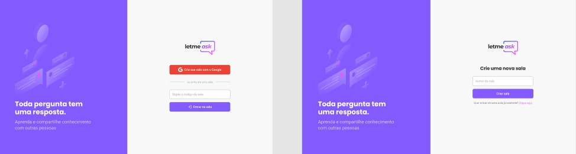
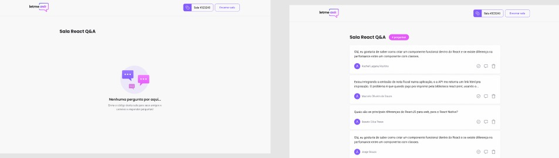
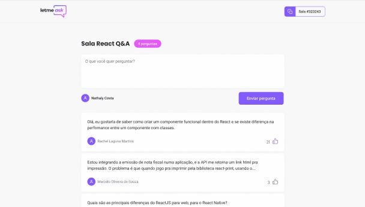

<h1 align="center">
    
</h1>

<h2 align="center">

[](https://github.com/pauloreis7/Foodfy/issues)
[](https://github.com/pauloreis7/Foodfy)
[](https://github.com/pauloreis7/Foodfy/commits)
[](https://github.com/pauloreis7/Foodfy/stargazers)
[](https://github.com/pauloreis7/Foodfy/blob/master/LICENSE)
	
</h2>

<h1 align="center">
    
</h1>

<h4 align="center">🏁 Aplicação já finalizada 🏁</h4>

<p align="center">🔊 Letmeask, Aplicação de salas para conversas com gerenciamento de perguntas 🤷‍♀️</p>

## 🔗 Índice
---
 <p>👉 <a href="#sobre">Sobre o projeto</a> </p>
 <p>👉 <a href="#layout">Layout da aplicação</a> </p>
 <p>👉 <a href="#func">Funcionalidades</a> </p>
 <p>👉 <a href="#tecs">Tecnologias utilizadas</a> </p>
 <p>👉 <a href="#requests">Pré-requisitos do projeto</a> </p>
 <p>👉 <a href="#work"> Download e execução do projeto</a> </p>
 <p>👉 <a href="#contribuir"> Contribuir com o projeto </a> </p>
 <p>👉 <a href="#autor"> Autor </a> </p>
 <p>👉 <a href="#license"> Licença </a> </p>

<a id="sobre"></a>
## 🔎 Sobre o projeto
---
<p >Aplicação para exibição de perguntas mais requisitadas da audiência para o(s) host(s). Letmeask é perfeito para criadores de conteúdos poderem criar salas de Q&A com o seu público, de uma forma muito organizada e democrática. </p>

<a id="layout"></a>
## 🎨 Layout
---




🚀 Este é um projeto desenvolvido durante a trilha de react da Next Level Week Together. Um evento online com muita qualidade para se profissionazar em uma tecnologia 🚀

<a id="func"></a>
## ✅ Funcionalidades
---
- [x] Autenticação de usuários
- [x] Cadastro e Remoção de salas
- [x] Gerenciamento de salas pelo admin
- [x] Votação nas salas por parte dos usários

<a id="tecs"></a>
## 🧪 Tecnologias
---
💻 Projeto desenvolvido com as seguintes tecnologias

- [React](https://reactjs.org/)
- [Firebase](https://firebase.google.com/)
- [TypeScript](https://www.typescriptlang.org/)

<a id="requests"></a>
## 🚨 Pré-requisitos do projeto
---
 Antes de começar, você vai precisar ter instalado em sua máquina as seguintes ferramentas:

* [Git](https://git-scm.com)
* [Yarn](https://yarnpkg.com/)

💡 Além disso é bom ter um editor para trabalhar com o código como [VSCode](https://code.visualstudio.com/)

<a id="work"></a>
## 🏄‍♂️ Download e execução do projeto e banco de dados
---

````bash

# Clonar o repositório
$ git clone <https://github.com/pauloreis7/Letmeask>

# Acessar a pasta do projeto terminal/cmd
$ cd Letmeask

# Abrir projeto no VsCode
$ code .

# Intalar as depêndencias do projeto
yarn install


# Executar a aplicação
$ yarn start

# O servidor inciará na porta:5000 
acesse  <http://localhost:3000>

````

<a id="contribuir"></a>
## 🎉 Como contribuir para o projeto

[](https://github.com/pauloreis7/Letmeask/pulls)

---

1. Faça um fork do projeto.
2. Crie uma nova branch com as suas alterações: git 3. checkout -b my-feature
4. Salve as alterações e crie uma mensagem de commit contando o que fez: git commit -m "feature: My new feature"
4. Envie as suas alterações: git push origin my-feature


<a id="autor"></a>
## Autor
---

## 👨‍💻 Autor

<a href="https://github.com/pauloreis7">


<b>Paulo Reis</b> 🏆 

</a>

<p>Feito por Paulo Reis 🤴 Entre em contato 👋</p>

[](https://www.facebook.com/paulofulano.reis)
[](https://www.instagram.com/paulo_reis.dev/)
[](mailto:paulosilvadosreis2057@gmail.com)

<a id="license"></a>
## 📝 Licença
---
Este projeto esta sobe a licença MIT 🏛️